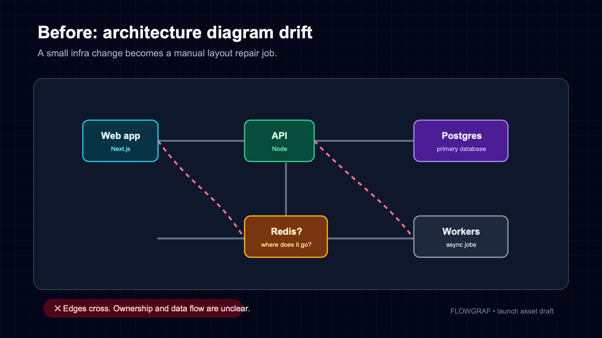
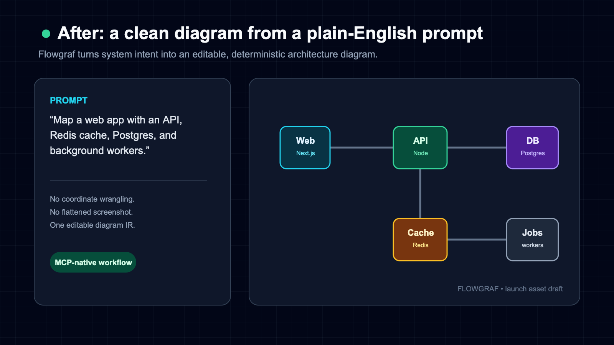
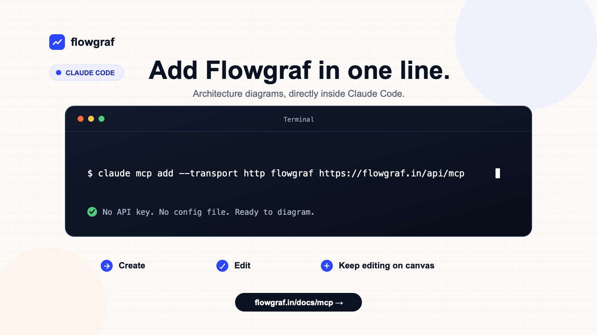
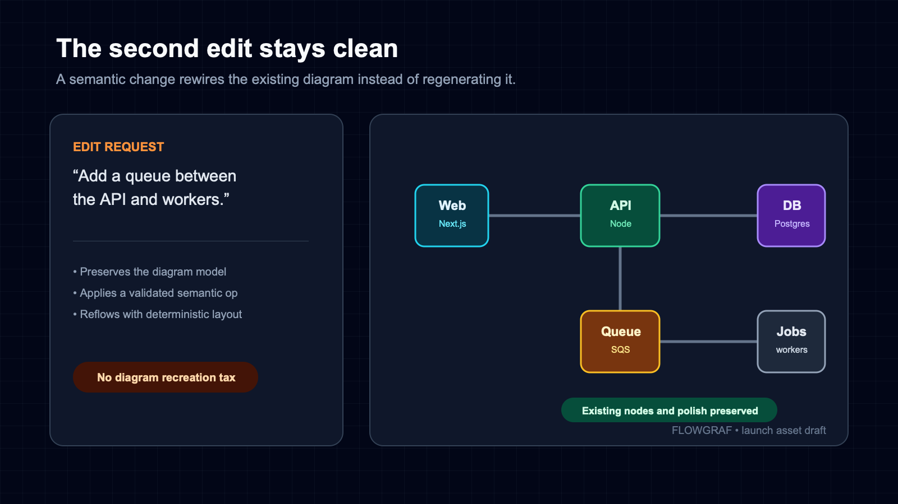

# flowgraf-mcp

**Create and edit clean, editable architecture diagrams from your AI agent — in plain English.**

[](https://www.npmjs.com/package/flowgraf-mcp)
[](./LICENSE)
[](https://glama.ai/mcp/servers/abhishek-genailytics/flowgraf-mcp)

[Flowgraf](https://flowgraf.in) turns a description of a system into a clean, auto-laid-out architecture diagram — then hands back a link to a **live canvas you can keep editing**, by chat or by hand. This package is the **stdio proxy** for MCP clients that speak stdio: it forwards to Flowgraf's hosted MCP endpoint. No API key, no LLM cost to you — your agent authors the diagram, Flowgraf lays it out and renders it.

```bash
npx -y flowgraf-mcp
```

---

## Why

Drawing architecture diagrams by hand is slow and rots the moment the system changes. With Flowgraf, you describe the system once and get a diagram you can edit semantically — *"add a Redis cache between the API and the database"* — and the edges re-route themselves.

<table>
  <tr>
    <td align="center"><br/><sub><b>Before:</b> hand-drawn, manual layout</sub></td>
    <td align="center"><br/><sub><b>After:</b> describe it, get a laid-out diagram</sub></td>
  </tr>
</table>

---

## Tools

The proxy forwards Flowgraf's tool list verbatim, so it always mirrors what the server exposes. Today that's three tools:

| Tool | What it does |
|------|--------------|
| `create_diagram` | Turn a graph (nodes + edges + groups) into a diagram → returns an SVG, a Mermaid string, and a `/d/<id>` canvas link |
| `edit_diagram` | Apply operations to an existing diagram (e.g. *insert a cache between two nodes*) — it re-wires and re-lays-out automatically |
| `get_diagram` | Fetch a diagram's current graph + version |

---

## Install

Requires **Node.js 18+**.

### Claude Code

Recommended — point Claude Code straight at the hosted **remote** endpoint (no local process to run):

```bash
claude mcp add --transport http flowgraf https://flowgraf.in/api/mcp
```

…or run it through this **stdio** proxy:

```bash
claude mcp add flowgraf npx flowgraf-mcp
```



### Cursor / Windsurf (stdio)

Add to your MCP config (`~/.cursor/mcp.json` for Cursor):

```json
{
  "mcpServers": {
    "flowgraf": {
      "command": "npx",
      "args": ["-y", "flowgraf-mcp"]
    }
  }
}
```

### OpenCode (stdio)

Add this to `~/.config/opencode/opencode.json` for all projects, or to `opencode.json`
in a project root:

```json
{
  "$schema": "https://opencode.ai/config.json",
  "mcp": {
    "flowgraf": {
      "type": "local",
      "command": ["npx", "-y", "flowgraf-mcp"],
      "enabled": true
    }
  }
}
```

Fully quit and restart OpenCode, then verify the server before your first prompt:

```bash
opencode mcp list
```

Expected status: `flowgraf connected`. Start `opencode` in the configured project and paste
one of the prompts below. This path is verified through the local stdio proxy. Direct remote
Streamable HTTP configuration is not yet verified for Flowgraf in OpenCode.

### Anything else

```bash
npx -y flowgraf-mcp
```

The proxy speaks the [Model Context Protocol](https://modelcontextprotocol.io) over stdio and forwards to the hosted API.

---

## How it works

`flowgraf-mcp` is a **thin, transparent stdio proxy**. It has zero business logic: `tools/list` and `tools/call` are forwarded verbatim to Flowgraf's hosted MCP endpoint (`/api/mcp`). Whatever the remote returns is handed straight back to your client.

That means two things:

- The tools you see are always exactly what Flowgraf ships — nothing to keep in sync here.
- You can skip the proxy entirely and connect any MCP client directly to `https://flowgraf.in/api/mcp` over HTTP (this is the recommended mode for Claude Code).

---

## Example

> **"Create an architecture diagram: a user hits an API gateway in a VPC, which talks to a Postgres database."**
>
> → `create_diagram` returns an SVG and a link like `https://flowgraf.in/d/abc123`. Open it to edit on the canvas.

<table>
  <tr>
    <td align="center"><br/><sub>Prompt → diagram</sub></td>
    <td align="center"><br/><sub>Semantic edit → re-layout</sub></td>
  </tr>
</table>

> **"Add a Redis cache between the API and the database."**
>
> → `edit_diagram` inserts the cache and re-routes the edge automatically — no manual cleanup.

---

## Configuration

By default the proxy targets Flowgraf's hosted endpoint. Override it (e.g. for local development) with an environment variable:

| Variable | Meaning |
|----------|---------|
| `FLOWGRAF_MCP_URL` | Full endpoint URL, e.g. `http://localhost:3000/api/mcp` |
| `FLOWGRAF_MCP_BASE_URL` | Base URL; `/api/mcp` is appended |

---

## Copyable prompts

**Simple**

> Create an architecture diagram of a web app where users connect to a load balancer, which
> routes requests to two app servers backed by a Postgres database. Return the editable
> Flowgraf canvas link.

**Medium**

> Create an architecture diagram of a RAG pipeline: a user query reaches an API, the API
> creates an embedding, searches a vector database, sends the retrieved context to an LLM,
> and returns the answer. Group ingestion separately with object storage, a document
> processor, and the same vector database. Return the editable Flowgraf canvas link.

**Edit an existing diagram**

> Using the Flowgraf diagram from the previous response, insert a message queue between the
> API and the workers, preserve the existing components, and return the updated canvas link.

## Links

- Website: <https://flowgraf.in>
- MCP endpoint: `https://flowgraf.in/api/mcp`

## License

MIT
